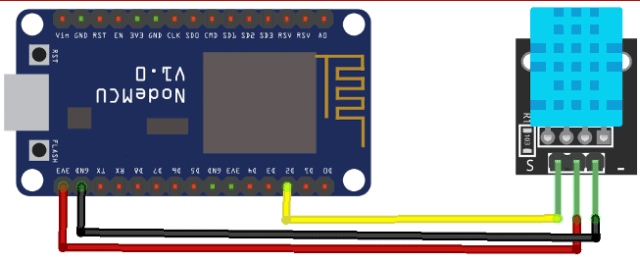

# 🌡️ ESP8266 DHT11 Firebase Logger

This project demonstrates reading temperature and humidity from a DHT11 sensor using an ESP8266 (e.g., NodeMCU) and uploading the data to Firebase Realtime Database.

---

## 💡 Features

- Reads **temperature** and **humidity** from DHT11 sensor.
- Uploads data to Firebase Realtime Database every 15 seconds.
- Uses **Firebase-ESP8266** library by Mobizt.

---

## 🛠️ Hardware Requirements

- ESP8266 development board (e.g., NodeMCU)
- DHT11 sensor
- Jumper wires
- Breadboard

---

## ⚙️ Software Requirements

- Arduino IDE
- [Firebase-ESP8266 library](https://github.com/mobizt/Firebase-ESP8266)
- DHT sensor library

---

## 🔌 Wiring

| DHT11 Pin | ESP8266 Pin |
|-------------|-------------|
| VCC         | 3.3V or 5V  |
| GND         | GND         |
| DATA        | D2 (GPIO4) |

---

## 🗺️ Schematic



---

## 🚀 Getting Started

### 1️⃣ Set up Firebase

1. Go to [Firebase Console](https://console.firebase.google.com/).
2. Create a new project.
3. Enable **Email/Password Authentication** in Authentication > Sign-in method.
4. Create a user (email & password) for your ESP8266 to log in.
5. Go to Realtime Database and create a database in **test mode** (you can secure it later).
6. Copy your **Database URL** (e.g., `https://your-project-id.firebaseio.com/`).
7. Go to Project Settings > General > Get your **Web API Key**.

---

### 2️⃣ Configure the Code

Replace these placeholders in your code:

```cpp
#define WIFI_SSID "YOUR_WIFI_SSID"
#define WIFI_PASSWORD "YOUR_WIFI_PASSWORD"
#define API_KEY "YOUR_FIREBASE_API_KEY"
#define DATABASE_URL "YOUR_DATABASE_URL"
#define USER_EMAIL "YOUR_FIREBASE_USER_EMAIL"
#define USER_PASSWORD "YOUR_FIREBASE_USER_PASSWORD"

```
## 3️⃣ Install Required Libraries
In Arduino IDE, go to Library Manager:

- Install [**Firebase ESP8266**](https://github.com/mobizt/Firebase-ESP8266) by Mobizt.
- Install [**DHT sensor library**](https://github.com/adafruit/DHT-sensor-library) by Adafruit.

## 4️⃣ Upload
- Connect ESP8266 to your PC.
- Select the correct board and port in Arduino IDE.
- Upload the code.
- Open Serial Monitor at **115200 baud** to see status and debug logs.

## 💻 Complete Example Code
```c

/**
 * Sample Firebase ESP8266 program to read DHT11 sensor values
 * and log them to Firebase Realtime Database.
 *
 * Based on Firebase-ESP8266 library by K. Suwatchai (Mobizt)
 * https://github.com/mobizt/Firebase-ESP8266
 */

#include <Arduino.h>
#include <ESP8266WiFi.h>
#include <FirebaseESP8266.h>
#include <DHT.h>

// Add your Wi-Fi credentials
#define WIFI_SSID "YOUR_WIFI_SSID"
#define WIFI_PASSWORD "YOUR_WIFI_PASSWORD"

// Your Firebase project credentials
#define API_KEY "YOUR_FIREBASE_API_KEY"
#define DATABASE_URL "YOUR_DATABASE_URL" // e.g., "https://your-project-id.firebaseio.com/"
#define USER_EMAIL "YOUR_FIREBASE_USER_EMAIL"
#define USER_PASSWORD "YOUR_FIREBASE_USER_PASSWORD"

// DHT11 sensor configuration
#define DHTPIN D2
#define DHTTYPE DHT11
DHT dht(DHTPIN, DHTTYPE);

// Firebase objects
FirebaseData fbdo;
FirebaseAuth auth;
FirebaseConfig config;

unsigned long sendDataPrevMillis = 0;

void setup()
{
  Serial.begin(115200);
  dht.begin();

  WiFi.begin(WIFI_SSID, WIFI_PASSWORD);
  Serial.print("Connecting to Wi-Fi");
  while (WiFi.status() != WL_CONNECTED)
  {
    Serial.print(".");
    delay(300);
  }
  Serial.println();
  Serial.print("Connected with IP: ");
  Serial.println(WiFi.localIP());

  config.api_key = API_KEY;
  auth.user.email = USER_EMAIL;
  auth.user.password = USER_PASSWORD;
  config.database_url = DATABASE_URL;
  config.token_status_callback = tokenStatusCallback; // optional

  Firebase.reconnectNetwork(true);
  fbdo.setBSSLBufferSize(4096, 1024);
  Firebase.begin(&config, &auth);
  Firebase.setDoubleDigits(5);
}

void loop()
{
  if (Firebase.ready() && (millis() - sendDataPrevMillis > 15000 || sendDataPrevMillis == 0))
  {
    sendDataPrevMillis = millis();
    float h = dht.readHumidity();
    float t = dht.readTemperature();

    if (isnan(h) || isnan(t))
    {
      Serial.println(F("Failed to read from DHT sensor!"));
      return;
    }

    Serial.print("Humidity: ");
    Serial.print(h);
    Serial.print("%  Temperature: ");
    Serial.print(t);
    Serial.println("°C");

    if (Firebase.setFloat(fbdo, F("/DHT11/Humidity"), h))
      Serial.println("Humidity data sent successfully.");
    else
      Serial.println(fbdo.errorReason());

    if (Firebase.setFloat(fbdo, F("/DHT11/Temperature"), t))
      Serial.println("Temperature data sent successfully.");
    else
      Serial.println(fbdo.errorReason());

    Serial.println();
  }
}

```

## 📊 Firebase Data Structure Example
```yaml
DHT11
├── Humidity: 55.0
└── Temperature: 27.0
```

## 🛡️ Security Note
✅ Important: Avoid committing your real Wi-Fi credentials, API keys, and passwords to public repositories. Always use placeholders or environment variables.

## 🤝 Credits
- [**Firebase-ESP8266 library**](https://github.com/mobizt/Firebase-ESP8266) by Mobizt
- [**DHT sensor library**](https://github.com/adafruit/DHT-sensor-library) by Adafruit

## 📬 License
This project is open-source and free to use for educational and personal projects.
